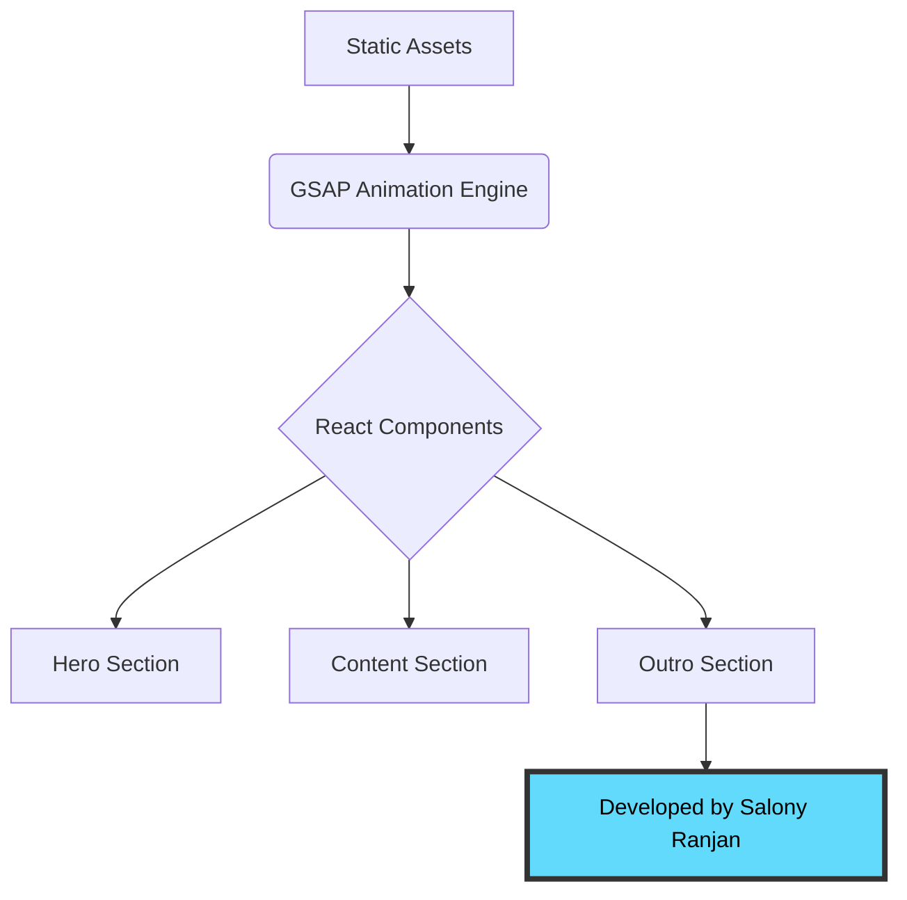

# 🌴 GTA VI Cinematic Landing Page

<p align="center">
  
</p>

<p align="center">
  <a href="https://gta-vi-woad.vercel.app/" target="_blank">
    
  </a>
  
  
</p>

<p align="center">
  
  
  
</p>

---

## 🚀 Experience the Cinematic UI
**Direct Link:** [https://gta-vi-woad.vercel.app/](https://gta-vi-woad.vercel.app/)

This dashboard is a technical recreation focused on **scroll-driven storytelling**. By leveraging the power of **Vercel** for deployment, the high-resolution assets and GSAP timelines are optimized for low-latency performance.

---

## 🚀 GTA-VI
A high-fidelity recreation of the **Grand Theft Auto VI** landing page. This project is a deep dive into **Scroll-driven UI/UX**, utilizing GSAP's `ScrollTrigger` to create a seamless, cinematic storytelling experience in the browser.

### 🎯 Key Learning Objectives
* Mastering complex **GSAP timelines** and staggered animations.
* Implementing responsive **Tailwind CSS** layouts for media-heavy sites.
* Optimizing high-resolution `.webp` assets for performance.
---
## 🏗️ Project Architecture

To manage the high-fidelity animations and assets, the project follows a decoupled architectural pattern. This ensures that the **GSAP Animation Engine** and the **React Component Lifecycle** work in harmony without performance bottlenecks.


---

## 🏗️ Technical Implementation

The core of this project is built on the synergy between **React's component-based architecture** and **GSAP's high-performance animation engine**. Below is a breakdown of the critical implementation details.

### 🎭 Animation Orchestration
I utilized the `@gsap/react` hook to ensure animations are properly scoped and cleaned up during the component lifecycle, preventing memory leaks—a critical "industry-standard" practice.

#### Key Implementation Snippet:
```javascript
// Outro.jsx - Handling the cinematic finale
useGSAP(() => {
  // 1. Initial State Setup
  gsap.set('.final-message', { marginTop: '-100vh', opacity: 0 });

  // 2. ScrollTrigger Timeline
  const tl = gsap.timeline({
    scrollTrigger: {
      trigger: '.final-message',
      start: 'top 30%',
      end: 'top 10%',
      scrub: true, // Smoothly ties animation to scroll progress
    }
  });

  // 3. Execution
  tl.to('.final-content', { opacity: 0, duration: 1, ease: 'power1.inOut' })
    .to('.final-message', { opacity: 1, duration: 1, ease: 'power1.inOut' });
}, { scope: containerRef }); // Scoped for performance
```

---
## 🛠️ Installation & Setup

Follow these steps to get a local copy of the project up and running on your machine.

### 1. Prerequisites
Make sure you have **Node.js** (v18.0 or higher) and **npm** installed.
* [Download Node.js](https://nodejs.org/)

### 2. Clone the Repository
```bash
git clone [https://github.com/salonyranjan/GTA-VI.git](https://github.com/salonyranjan/GTA-VI.git)
cd GTA-VI
```
### 3. Install Dependencies
This will install React, GSAP, and Tailwind CSS.
```bash
npm install
```
### 4. Run the Development Server
```bash
npm run dev
```
### The application will be available at http://localhost:5173

### 5. Build for Production
To generate a production-ready build (for AWS EC2 or Vercel deployment):
```bash
npm run build
```

---

## 👤 Author

**Salony Ranjan**

<p align="left">
  <a href="https://linkedin.com/in/salony-ranjan-b63200280">
    
  </a>
  <a href="https://github.com/salonyranjan">
    
  </a>
  <a href="mailto:salonyranjan@gmail.com">
    
  </a>
</p>

---
<p align="center">
  Recreated with ❤️ by Salony Ranjan | 2026
</p>
