<div align="center">

<!-- ══════════════════════════════════════════════════════════════ -->
<!--                       HERO BANNER                            -->
<!-- ══════════════════════════════════════════════════════════════ -->


<br/>

<!-- ── Hero Image ── -->
<a href="https://gta-vi-woad.vercel.app/" target="_blank">
  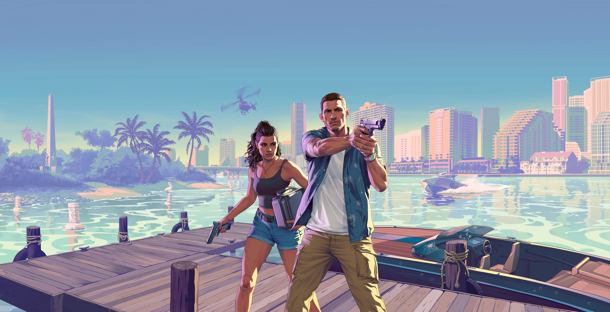
</a>

<br/><br/>


<br/><br/>

<!-- ── Tech Badges ── -->
<a href="https://gta-vi-woad.vercel.app/" target="_blank">
  
</a>

<br/>


<br/>


<br/>


<br/><br/>

> *"A high-fidelity recreation of the GTA VI landing experience — where scroll-driven storytelling meets cinematic browser engineering."*

<br/>

<a href="https://gta-vi-woad.vercel.app/"></a>
&nbsp;
<a href="#8--getting-started"></a>
&nbsp;
<a href="#4--technical-implementation"></a>
&nbsp;
<a href="#10--roadmap"></a>

</div>

---

## 📋 Table of Contents

1. [🌴 What is This Project?](#1--what-is-this-project)
2. [🖼️ Visual Showcase](#2-%EF%B8%8F-visual-showcase)
3. [📊 Project at a Glance](#3--project-at-a-glance)
4. [🎭 Technical Implementation](#4--technical-implementation)
   - 4.1 [🎬 Animation Orchestration](#41--animation-orchestration)
   - 4.2 [🌊 Scroll-Driven Strategy](#42--scroll-driven-strategy)
   - 4.3 [⚡ Performance Strategy](#43--performance-strategy)
5. [🏗️ Architecture](#5-%EF%B8%8F-architecture)
   - 5.1 [📐 Component Architecture](#51--component-architecture)
   - 5.2 [🔄 Animation Flow Diagram](#52--animation-flow-diagram)
   - 5.3 [⚡ Sequence Diagram](#53--sequence-diagram)
6. [🛠️ Tech Stack](#6-%EF%B8%8F-tech-stack)
7. [📂 Project Structure](#7--project-structure)
8. [📦 Getting Started](#8--getting-started)
   - 8.1 [🔧 Prerequisites](#81--prerequisites)
   - 8.2 [⬇️ Install & Run](#82-%EF%B8%8F-install--run)
9. [🚀 Deployment](#9--deployment)
10. [🗺️ Roadmap](#10-%EF%B8%8F-roadmap)
11. [🤝 Contributing](#11--contributing)
12. [❓ FAQ](#12--faq)
13. [📄 Changelog](#13--changelog)
14. [👤 Author](#14--author)
15. [⭐ Show Your Support](#15--show-your-support)

---

## 1. 🌴 What is This Project?

**GTA VI Cinematic Landing Page** is a high-fidelity browser recreation of the *Grand Theft Auto VI* landing experience. It is a deep technical dive into **scroll-driven UI/UX** — using GSAP's `ScrollTrigger` to create a seamless, cinematic storytelling arc: from the opening hero scene through narrative content sections to the dramatic outro finale, all orchestrated in pure React + GSAP with zero video.

> 🎯 **Built to master:** Complex GSAP timeline orchestration, scoped `useGSAP` lifecycle management, responsive Tailwind layouts for media-heavy sites, and WebP asset optimisation at cinematic scale.

| 🔖 | Version | 📦 Highlight |
|:---:|:---:|:---|
| 🆕 | `v1.0` | Full scroll-driven cinematic flow · WebP asset optimisation · Vercel edge deploy |

---

## 2. 🖼️ Visual Showcase

GTA VI is engineered to deliver the full Vice City atmosphere directly in the browser. Every section is scroll-triggered, every asset WebP-optimised, every transition choreographed frame-by-frame.

<div align="center">


</div>

---

### 🌴 Immersive Hero Scene

<div align="center">
  
  <p><i>Cinematic hero — GSAP fade-in orchestrated with scroll position scrubbing.</i></p>
</div>

> 🎬 **GSAP timeline** syncs hero asset reveal directly to scroll entry · `.webp` format keeps 4K imagery under 200KB · Responsive viewport scaling via Tailwind breakpoints

---

### 🏙️ Narrative Content — *The Story Unfolds*

<div align="center">
  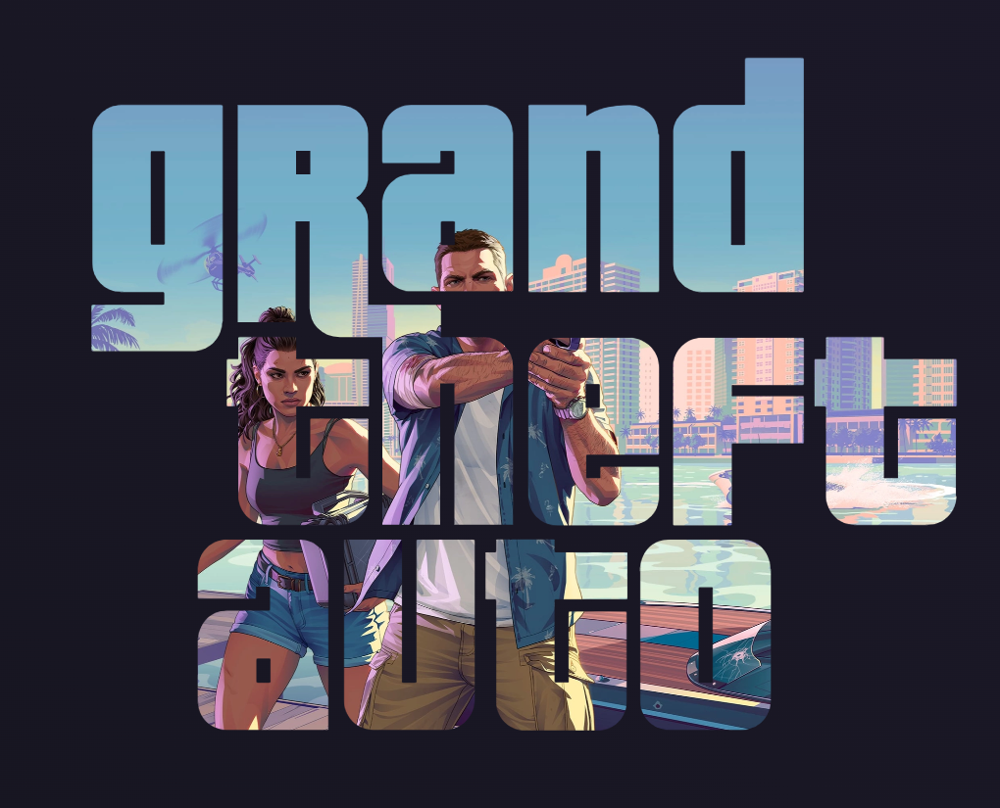
  <p><i>Content section 1 — staggered text and image reveals tied to scroll depth.</i></p>
</div>

<div align="center">
  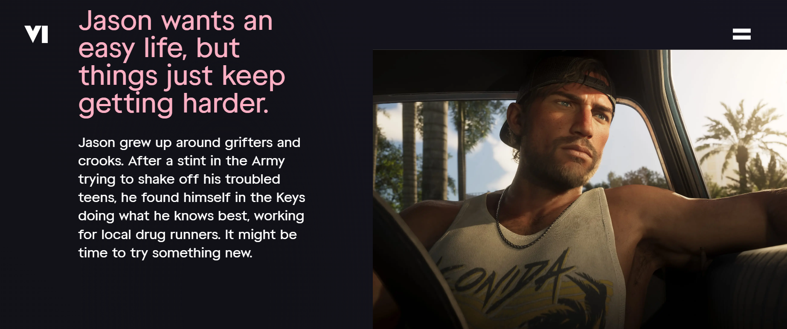
  <p><i>Content section 2 — parallax asset layering creates dimensional depth.</i></p>
</div>

<div align="center">
  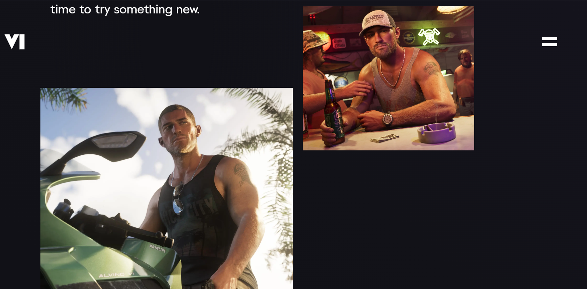
  <p><i>Content section 3 — opacity and transform values scrubbed in real-time with scroll progress.</i></p>
</div>

> 🌊 Each content section uses a **dedicated ScrollTrigger timeline** — `start`, `end`, and `scrub` values are tuned per section for the perfect reveal cadence

---

### 🎭 Cinematic Transitions — *Between Worlds*

<div align="center">
  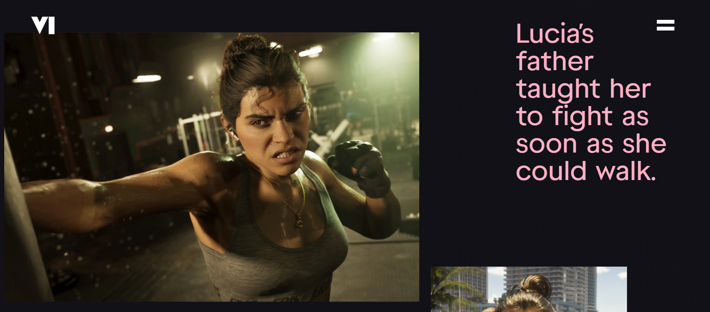
  <p><i>Transition 1 — cross-fade between scenes via opacity scrub on overlapping layers.</i></p>
</div>

<div align="center">
  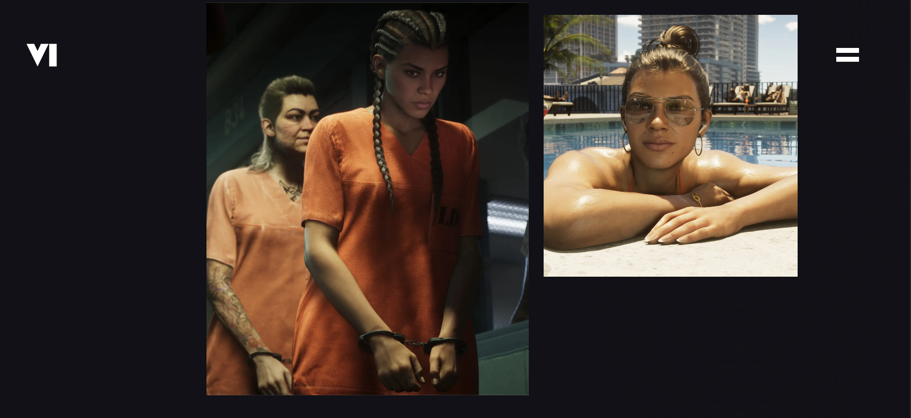
  <p><i>Transition 2 — scale and blur effects echo the cinematic language of the official trailer.</i></p>
</div>

> ⚡ Transitions achieved by **stacking absolutely-positioned layers** and scrubbing their `opacity` values in opposite directions — no video, no canvas, pure CSS + GSAP

---

### 🌅 Outro Finale — *The Cinematic Close*

<div align="center">
  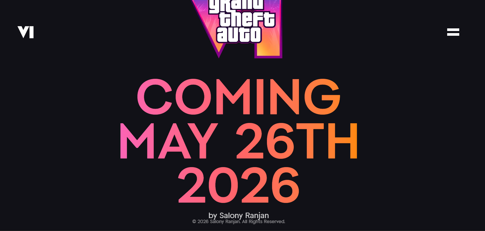
  <p><i>The finale — final-message rises from below as content section fades to black.</i></p>
</div>

> 🎯 The outro uses a **dual-timeline sequence**: `final-content` fades out while `final-message` simultaneously rises — perfectly choreographed via a shared GSAP `ScrollTrigger` scope

---

<div align="center">

*<i>"VertexFlow leverages GSAP ScrollTrigger to deliver a silky-smooth 60 FPS cinematic experience that adapts seamlessly across all device tiers."</i>*

</div>

<div align="center">

| 🖥️ Section | 📱 Mobile | 💻 Tablet | 🖥️ Desktop |
|:---|:---:|:---:|:---:|
| 🌴 Hero Scene | ✅ | ✅ | ✅ |
| 🏙️ Narrative Content | ✅ | ✅ | ✅ |
| 🎭 Transitions | ✅ | ✅ | ✅ |
| 🌅 Outro Finale | ✅ | ✅ | ✅ |

</div>

---

## 3. 📊 Project at a Glance

| 🔢 Metric | 🎯 Value | 📝 Notes |
|:---|:---:|:---|
| 🎬 **Animation FPS** | `60fps` | Hardware-accelerated GSAP transforms |
| 🖼️ **Asset Format** | `.webp` | 4K imagery at <200KB per asset |
| 📜 **Scroll Sections** | `3` | Hero · Content · Outro |
| 🎭 **Animation Type** | `ScrollTrigger scrub` | Real-time scroll-progress binding |
| ⚡ **Build Tool** | `Vite` | Sub-second HMR |
| 🔒 **Memory Safety** | `useGSAP scoped` | Auto-cleanup on unmount |
| 🌍 **Deployment** | `Vercel Edge` | Global CDN, auto-deploy on push |

---

## 4. 🎭 Technical Implementation

### 4.1 🎬 Animation Orchestration

The project uses `@gsap/react`'s `useGSAP` hook to scope all animations inside the component lifecycle — the industry-standard practice for preventing memory leaks in React + GSAP applications.

**Outro.jsx — The Cinematic Finale:**

```javascript
useGSAP(() => {
  // 1. Set initial state — hide final message off-screen
  gsap.set('.final-message', { marginTop: '-100vh', opacity: 0 });

  // 2. Build the scroll-triggered timeline
  const tl = gsap.timeline({
    scrollTrigger: {
      trigger: '.final-message',
      start: 'top 30%',   // Animation begins when element hits 30% viewport
      end:   'top 10%',   // Animation completes at 10% viewport
      scrub: true,         // Ties animation to scroll progress — no fixed duration
    }
  });

  // 3. Dual-layer choreography — both run simultaneously
  tl.to('.final-content', { opacity: 0, duration: 1, ease: 'power1.inOut' })
    .to('.final-message', { opacity: 1, duration: 1, ease: 'power1.inOut' });

}, { scope: containerRef }); // Scoped — GSAP cleans up on component unmount
```

> 💡 **Why `scrub: true`?** Instead of a fixed-duration animation that plays once, `scrub` binds animation progress directly to the scroll position — giving the user full control over the pacing and creating the "cinematic film scrubbing" feel.

### 4.2 🌊 Scroll-Driven Strategy

Each section has its own `ScrollTrigger` instance with independently tuned parameters:

| 📄 Section | 🎬 Trigger | 🎯 Animation | ⚙️ Scrub |
|:---|:---|:---|:---:|
| 🌴 **Hero** | Page entry | Fade-in + scale `1.1 → 1.0` | `true` |
| 🏙️ **Content** | `top 80%` → `top 20%` | Staggered text + image reveals | `1` (smoothed) |
| 🎭 **Transitions** | `top 50%` | Cross-layer opacity scrub | `true` |
| 🌅 **Outro** | `top 30%` → `top 10%` | Dual fade — content out, message in | `true` |

### 4.3 ⚡ Performance Strategy

- **WebP Format** — All images converted to `.webp`, reducing file size 60–80% vs JPEG with no quality loss.
- **`will-change: transform`** — Applied to animated elements to promote GPU compositing before animation starts.
- **`immediateRender: false`** — Prevents GSAP from snapping elements to end-state on page load before ScrollTrigger initialises.
- **Scoped Contexts** — `{ scope: containerRef }` in `useGSAP` ensures animations never leak across component boundaries.
- **Vite Tree-Shaking** — Production build tree-shakes unused GSAP modules for a minimal bundle.

---

## 5. 🏗️ Architecture

### 5.1 📐 Component Architecture

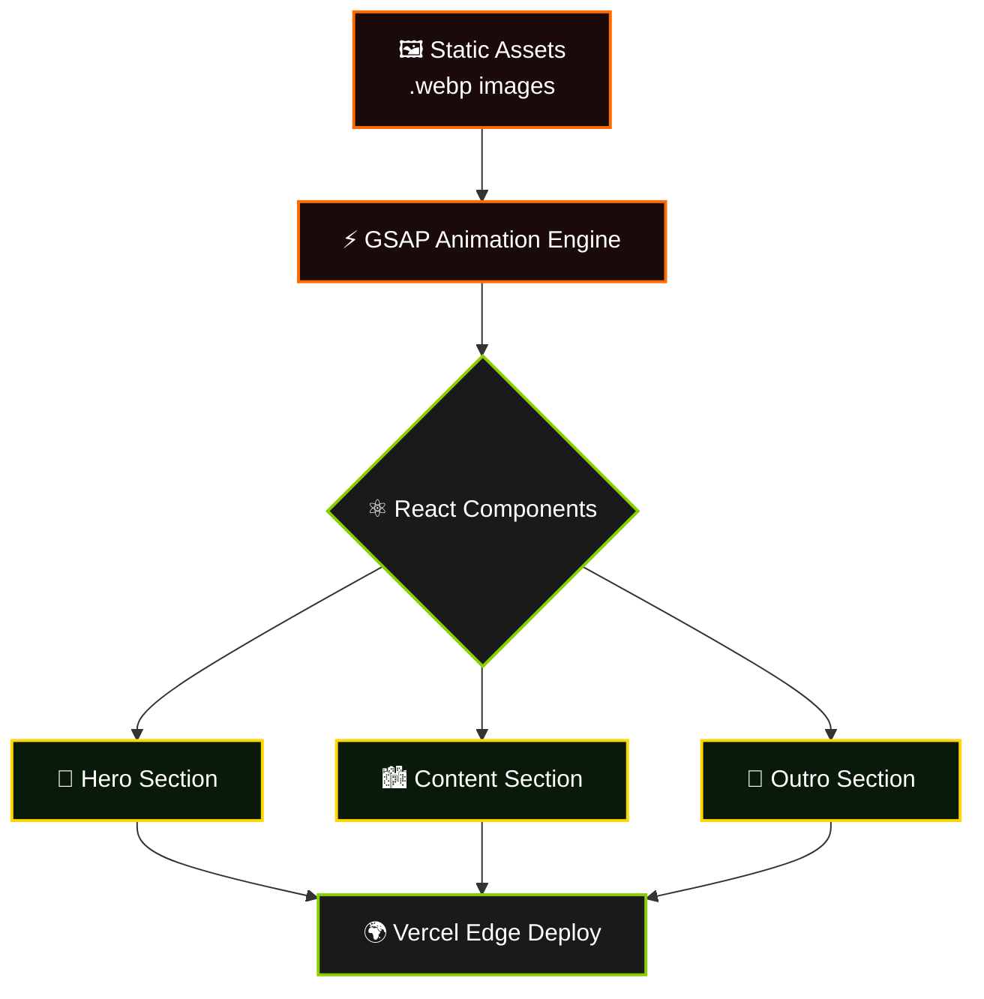

### 5.2 🔄 Animation Flow Diagram

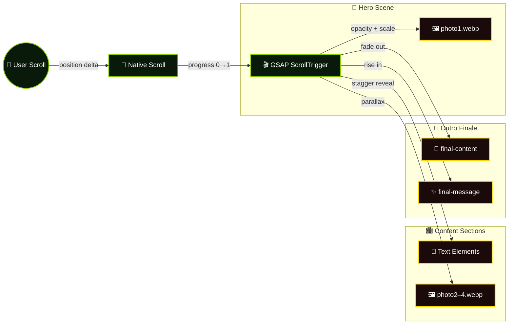

### 5.3 ⚡ Sequence Diagram

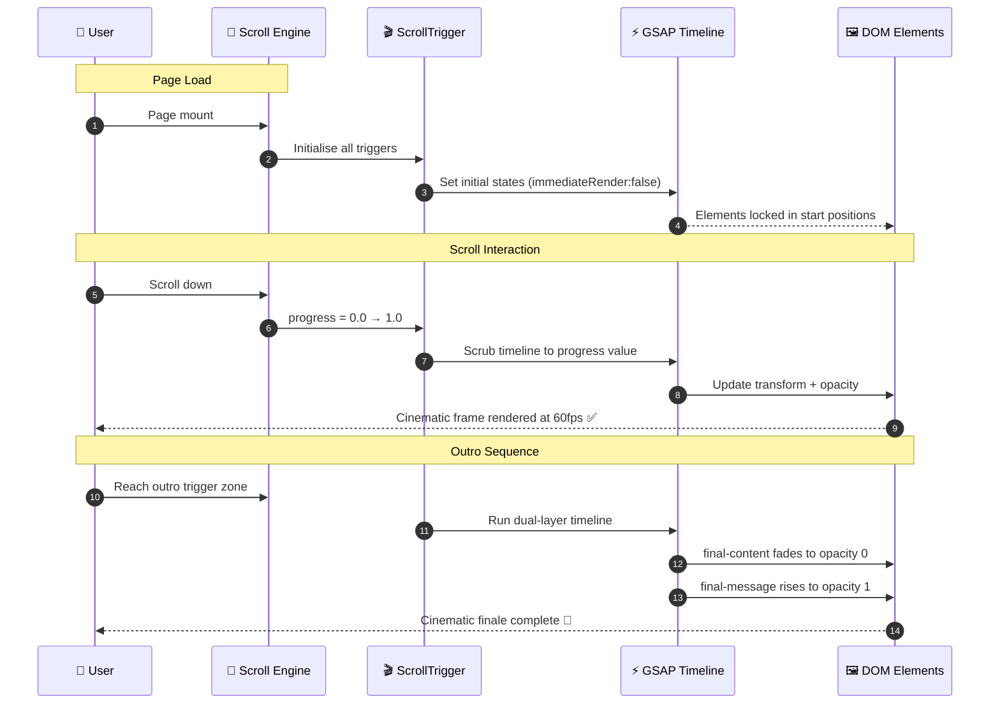

---

## 6. 🛠️ Tech Stack

### 🎬 Animation & Motion
<p>
  
  
  
</p>

### ⚛️ Frontend & Build
<p>
  
  
  
</p>

### ☁️ Deploy & Assets
<p>
  
  
</p>

| ⚙️ Technology | 🔬 Usage | 🏆 Result |
|:---|:---|:---|
| **GSAP + ScrollTrigger** | Scroll-bound timeline orchestration | Cinematic frame-perfect storytelling |
| **`useGSAP` hook** | Scoped React + GSAP lifecycle | Zero memory leaks on unmount |
| **React** | Component-based UI architecture | Declarative, reusable section structure |
| **Vite** | Dev server + production bundler | Sub-second HMR, optimised chunks |
| **Tailwind CSS** | Responsive utility-first styling | Mobile-first layouts, zero runtime CSS |
| **WebP** | Compressed high-res assets | 4K quality at <200KB per image |
| **Vercel** | Edge CDN deployment | Global low-latency delivery |

---

## 7. 📂 Project Structure

```
🌴 GTA-VI/
│
├── 🌐 public/
│   └── 🖼️ images/
│       ├── 📸 photo1.webp       # Hero scene — opening frame
│       ├── 📸 photo2.webp       # Content section 1
│       ├── 📸 photo3.webp       # Content section 2
│       ├── 📸 photo4.webp       # Content section 3
│       ├── 📸 photo5.webp       # Transition scene 1
│       ├── 📸 photo6.webp       # Transition scene 2
│       └── 📸 photo7.webp       # Outro finale frame
│
├── 💻 src/
│   ├── 🧩 components/
│   │   ├── 🌴 Hero.jsx          # Hero section — entry animation
│   │   ├── 🏙️ Content.jsx       # Narrative content with parallax
│   │   └── 🌅 Outro.jsx         # Cinematic finale + final-message
│   │
│   ├── 🏠 App.jsx               # Root — section assembly + scroll init
│   ├── 🚀 main.jsx              # Vite entry point
│   └── 🎨 index.css             # Global styles + Tailwind directives
│
├── 📄 index.html                 # Entry HTML, meta & Open Graph tags
├── 🎨 tailwind.config.js         # Tailwind custom config
├── ⚡ vite.config.js             # Vite bundler configuration
└── 📦 package.json               # Dependencies & npm scripts
```

---

## 8. 📦 Getting Started

Get the project running locally in under **2 minutes**.

### 8.1 🔧 Prerequisites

| 🛠️ Tool | 📌 Version | 🔗 Link |
|:---|:---:|:---|
|  | `≥ 18.x` | [nodejs.org](https://nodejs.org/) |
|  | `≥ 8.x` | Bundled with Node |
|  | any | [git-scm.com](https://git-scm.com/) |
|  | latest | Best GSAP ScrollTrigger performance |

### 8.2 ⬇️ Install & Run

**📥 Step 1 — Clone**

```bash
git clone https://github.com/salonyranjan/GTA-VI.git
cd GTA-VI
```

**📦 Step 2 — Install dependencies**

```bash
npm install
# Installs React, GSAP, Tailwind CSS, and Vite
```

**🖥️ Step 3 — Dev server**

```bash
npm run dev
# → http://localhost:5173
```

**🏗️ Step 4 — Production build**

```bash
npm run build
# Optimised output in dist/
```

| 📜 Script | 💻 Command | 📝 Purpose |
|:---|:---|:---|
| 🚀 Dev | `npm run dev` | Vite HMR at `localhost:5173` |
| 🏗️ Build | `npm run build` | Optimised `dist/` output |
| 🔍 Preview | `npm run preview` | Test production build locally |
| 🧹 Lint | `npm run lint` | ESLint code quality check |

---

## 9. 🚀 Deployment

Configured for **zero-config Vercel deployment**:

| ⚙️ Setting | 🔧 Value |
|:---|:---|
| **Framework Preset** | Vite |
| **Build Command** | `npm run build` |
| **Output Directory** | `dist` |
| **Node.js Version** | `18.x` |

```
1. Push repo to GitHub
2. Import at vercel.com/new
3. Framework auto-detected as Vite
4. Click Deploy ✅ — live in under 60 seconds
```

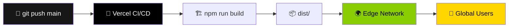

> 🔄 Vercel auto-redeploys on every `git push` to main — zero manual steps.

---

## 10. 🗺️ Roadmap

| Status | 🚀 Feature | 🎯 Priority |
|:---:|:---|:---:|
| ✅ | Hero scroll-driven reveal | 🔴 Core |
| ✅ | Content section stagger animations | 🔴 Core |
| ✅ | Cinematic outro dual-timeline | 🔴 Core |
| ✅ | WebP asset optimisation | 🔴 Core |
| ✅ | Vercel edge deployment | 🔴 Core |
| 🔄 | **Lenis smooth scroll** — eliminate native scroll jank | 🟡 High |
| 🔄 | **Sound design** — ambient audio synced to scroll depth | 🟡 High |
| 🔄 | **Particle system** — GSAP-driven floating ambient elements | 🟡 High |
| 📅 | **Character animations** — GSAP MotionPath for sprite movement | 🟢 Planned |
| 📅 | **Video integration** — scrubbed video playback via ScrollTrigger | 🟢 Planned |
| 💡 | **WebGL overlay** — Three.js depth effects over 2D assets | 🔵 Idea |

> 💬 [Open a feature request →](https://github.com/salonyranjan/GTA-VI/issues/new)

---

## 11. 🤝 Contributing

```bash
# 1. Fork the repository
# 2. Create your feature branch
git checkout -b feature/your-feature

# 3. Commit with conventional format
git commit -m "feat: add your feature"

# 4. Push & open a PR
git push origin feature/your-feature
```

**Guidelines:**
- Keep animation performance in mind — profile with Chrome DevTools before submitting
- Test scroll behaviour across Chrome, Firefox, and Safari
- Follow the existing `useGSAP` scoping pattern for all new animations

---

## 12. ❓ FAQ

<details>
<summary><strong>🎬 Why use GSAP instead of CSS animations?</strong></summary>

CSS animations can't synchronise with scroll position in real-time — they play once and stop. GSAP's `ScrollTrigger` with `scrub: true` binds animation progress directly to scroll, giving users frame-level control over the storytelling. It also handles `will-change` management and compositor optimisation automatically.
</details>

<details>
<summary><strong>🖼️ Why are all assets in `.webp` format?</strong></summary>

The GTA VI aesthetic demands high-resolution cinematic imagery. WebP delivers 60–80% smaller file sizes vs JPEG at equivalent quality, keeping page load fast even with 4K assets. All modern browsers support WebP natively.
</details>

<details>
<summary><strong>🔒 What does `{ scope: containerRef }` in useGSAP do?</strong></summary>

It scopes all GSAP selector queries to within the referenced container only — preventing animation conflicts. More importantly, it triggers automatic cleanup of all ScrollTriggers and tweens when the component unmounts, preventing memory leaks in React's strict mode.
</details>

<details>
<summary><strong>⚡ Why does the animation feel smoother in Chrome?</strong></summary>

Chrome's compositor handles `transform` and `opacity` animations on the GPU thread more aggressively than Firefox. GSAP avoids animating layout-triggering properties (`width`, `height`, `top/left`) and sticks to `transform` + `opacity` only — but Chrome enforces GPU promotion more consistently.
</details>

---

## 13. 📄 Changelog

| Version | Highlights |
|:---|:---|
| 🆕 `v1.0.0` | 🎉 Full scroll-driven cinematic landing · Hero + Content + Outro · WebP optimised · Vercel deploy |

---

## 14. 👤 Author

<table style="border:none;">
  <tr>
    <td align="center" style="border:none;" width="160">
      
    </td>
    <td style="border:none; padding-left:22px;">
      <h3>✦ Salony Ranjan</h3>
      <p>🎬 Frontend Developer &nbsp;·&nbsp; 🎮 Creative Engineer &nbsp;·&nbsp; ⚡ Animation Specialist</p>
      <p><em>"Pushing the browser to its cinematic limits — one ScrollTrigger at a time."</em></p>
      <br/>
      <a href="https://linkedin.com/in/salony-ranjan-b63200280"></a>
      &nbsp;
      <a href="https://github.com/salonyranjan"></a>
      &nbsp;
      <a href="mailto:salonyranjan@gmail.com"></a>
      &nbsp;
      <a href="https://vertex-flow-phi.vercel.app/"></a>
    </td>
  </tr>
</table>

---

## 15. ⭐ Show Your Support

<div align="center">

If this project taught you a GSAP technique, inspired your next cinematic build, or just made you feel the Vice City heat — show it some love! 🌴

> 💡 **Pro Tip:** Go to GitHub repo **Settings → Social Preview** and upload `photo1.webp`. When you share on LinkedIn, the cinematic hero frame renders as the card preview instead of a generic GitHub logo.

<a href="https://github.com/salonyranjan/GTA-VI/stargazers"></a>
&nbsp;
<a href="https://github.com/salonyranjan/GTA-VI/fork"></a>
&nbsp;
<a href="https://gta-vi-woad.vercel.app/"></a>
&nbsp;
<a href="https://github.com/salonyranjan/GTA-VI/issues/new"></a>

<br/><br/>


<br/>

*Recreated with* ❤️ *by* [**Salony Ranjan**](https://github.com/salonyranjan) &nbsp;·&nbsp; *© 2026 GTA VI Landing · MIT*


</div>
